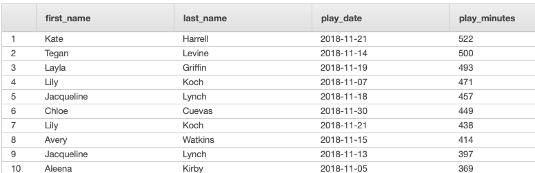

# Udacity DEND - Project 3: Cloud Data Warehouse

## Background
Sparkify want to be able to query their user data to get more information on the songs that are being played.  By combining the logs (which capture the user and their song play events) with the song database an analytics platform for song play analysis can be implemented.

This is a first cut at the etl workflow and it is clear that the chosen method for uploading the song data into the redshift staging tables is sub-optimal.  Suggestions for improving this are discussed below.

It would be useful to receive feedback on the decisions made egarding the table distribution and sortkey choices.


## Overall Workflow

1. The buckets and keys for the json log files and the json song files on Amazon S3 are identified. 
2. The staging tables and the data warehouse tables are created in Amazon Redshift.
2. The log files and song files are bulk copied to the staging tables in Amazon Redshift. 
3. The songs, artists, times, users and songplays tables are populated from the staging tables.

## Files

The following files form part of this project:

- **create_tables.py** : Run this python file to create the staging tables, fact and dimension tables.
- **etl.py** : Run this python file to load the data from the source files on S3 into the staging tables.  Inserts the records into the fact and dimension tables.
- **sql_queries.py** : This file supports the create_tables.py and etl.py code by providing the SQL queries which create the tables and load the data.
- **dwh.cfg** : Holds the configuration settings for the ETL system.  A manifest file was created to enable loading of the song files using the COPY method and this configuration file contains the url for that file.


## Staging Table Design
There are two staging tables: staging_events and staging_songs.

The staging tables were designed to enable ingest into the system while reducing the chance of error due to column overflow.  Wide varchar columns were used where necessary.  The columns simply follow the format of a sample of the log and song data.  There is no constraint on any of the fields to be NOT NULL under the expectation that checking for invalid null values will be carried out between staging and insert into the fact and dimension tables.

### Sortkeys
The staging_events table is sorted by the start_time field.  This should streamline the insertion of data into the time and songplays tables which both use the start_time field as part of their sorting criteria.

The staging_songs table is distributed by the song_id field.  This should treamline the insertion of data into the songs table which also uses the song_id field as the distribution key. The staging_songs table is sorted by song_id.

## Fact and Dimension Table Design

### Distribution Decisions

The distribution decisions for the fact and dimension tables are described below:

- songs: ** Distribution Key = song_id**  There were two reasons for selecting distribution by distribution key: 
    - There is an expectation that the songs table could become too large for ALL distribution
    - There is an expectation that the most common join will be between the songplays and the songs so distributing both tables by song_id should support the efficient execution of the join
- songplays: ** Distribution Key = song_id**  Explanation as above.
- artists: ** All Distribution **   It is not expected that the artists table will get so large for this duplication of data in Redshift to become unmanageable.
- users: ** All Distribution **   It is not expected that the users table will get so large for this duplication of data in Redshift to become unmanageable.
- times: ** Even Distribution **  It was felt that over time the times table could become so large that the ALL distribution option would be inappropriate so even distribution was selected.

The performance of queries should be analysed after a period to ascertain if the distribution choices are effective.

### Sortkey Decisions
The decision was made to sort by the primary key for each table only at this stage (except in the case of songplays which is sorted by song_id and start_time) due to the lack of real understanding of the types of analytic queries which will be run.  After some use the performance of queries can be analysed and if necessary a re-implementation of tables with additional or new sortkeys can take place.


### Primary and Foreign Key Decisions

The decision was made to specify the primary key constraints on all tables and foreign key constraints on the songplays table because this can improve query performance.  It is understood that these constraints are not enforced by Amazon Redshift and the responsibility for ensuring uniqueness is that of the insert code.  There is no upsert code currently (only insert) but again this would need to ensure uniqueness of primary keys. 

### Compression Decisions

In addition to the final workflow described, the *analyze compression* command was run on the fact and dimension tables during the testing phase to obtain information about compression settings that could be used.  All of the suggested compressions have been implemented except for those on the chosen sortkey values for a table which have been left raw.

## ETL Design

### COPY Method to Populate Staging Tables
The decision was taken to use Redshift's COPY command to populate the staging tables.  The prefix method worked well for the log data.

Due to the fact that the song files did not have a common prefix the manifest method of COPY was used for uploading the song data into Redshift however this was painfully slow firstly due to the overhead of accessing S3 on a per-file basis and secondly due to the overhead of then loading into Redshift on a per-file basis.  My current suggestion for improving this would be to combine the individual JSON song files into a set of files which is a multiple of the number of slices in the cluster and containing somewhere between 1MB and 125MB of data each to maximise the parallel upload of data.  ** This is yet to be implemented ** but it would follow the same principal of the existing implementation except the manifest would name, say, 24 files of roughly similar size containing the combined JSON data of multiple files.

### INSERT INTO SELECT Method to Populate Fact and Dimension Tables

A small amount of data cleaning was carried our during the INSERT INTO SELECT phase of populating the fact and dimension tables from the staging tables:

- Only unique ids were selected for entry into users, songs, artists and time.  GROUP BY was used instead of DISTINCT in case of updates to the data e.g. a user changing level from 'free' to 'paid' which would result in two entries for a single user_id.
- Only records in the staging_events table corresponding to "NextSong" actions were selected for insertion into songplays and time.
- Records in the staging_events table without a matching song_id, artist_id and duration were written to the songplays table so that the user action of playing the song was not lost.   
- When identifying song_id and artist_id values from the songs database the duration of songs was compared at the level of seconds rather than to several decimal places to avoid missing matches because of small data inaccuracies.

## Conclusion

Despite the improvements required in the data loading choices for the song data the data has loaded to a state where effective song play analysis is possible.

## Example Queries

Several example queries have been run to establish the capabilities of the database.

###  QUERY: Select The Top 10 Most-Played Songs

```
WITH sc (song_id, play_count) as
        (SELECT
		s.song_id, count(s.song_id) 
		FROM songplays s
		GROUP BY s.song_id)
        
SELECT   TOP 10    
	s.title as song_title, 
    a.name artist_name,
    sc.play_count
FROM
	songs s
    JOIN sc
    ON sc.song_id = s.song_id
```


###  QUERY: Select top 10 duration of songs played in a day


```
WITH ud(user_id, play_date, play_dur) AS
(SELECT TOP 10
	sp.user_id, 
 	TO_DATE(TO_CHAR(t.year, '0000')+'-'+TO_CHAR(t.month, '00')+'-'+
            TO_CHAR(t.day, '00'), 'YYYY-MM-DD') as play_date,
 	round(sum(s.duration)) as play_dur
	FROM songplays sp
    JOIN time t
    ON t.start_time = sp.start_time
    JOIN songs s
    ON s.song_id = sp.song_id
	GROUP BY sp.user_id, t.year, t.month, t.day
	ORDER BY play_dur desc)
 
 SELECT u.first_name,
 		u.last_name,
        ud.play_date,
 		TRUNC(ud.play_dur/60) as play_minutes
 FROM ud
 JOIN users u
 ON u.user_id = ud.user_id
 ORDER BY play_minutes desc
 ```
 
 
 